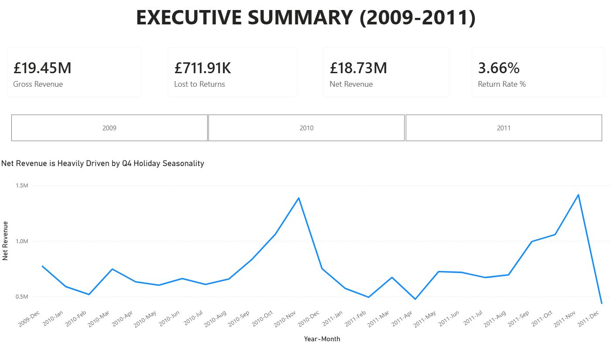
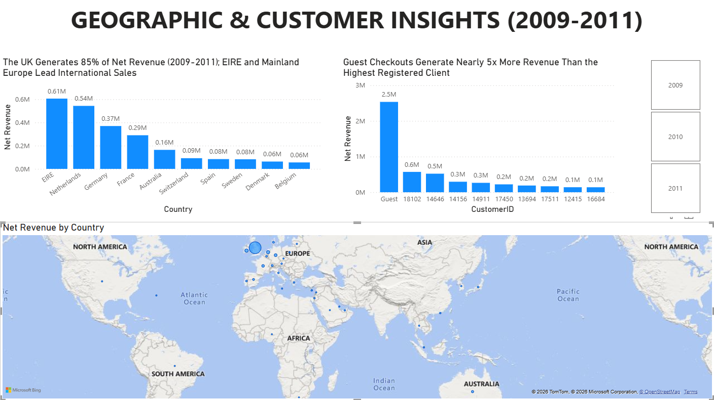
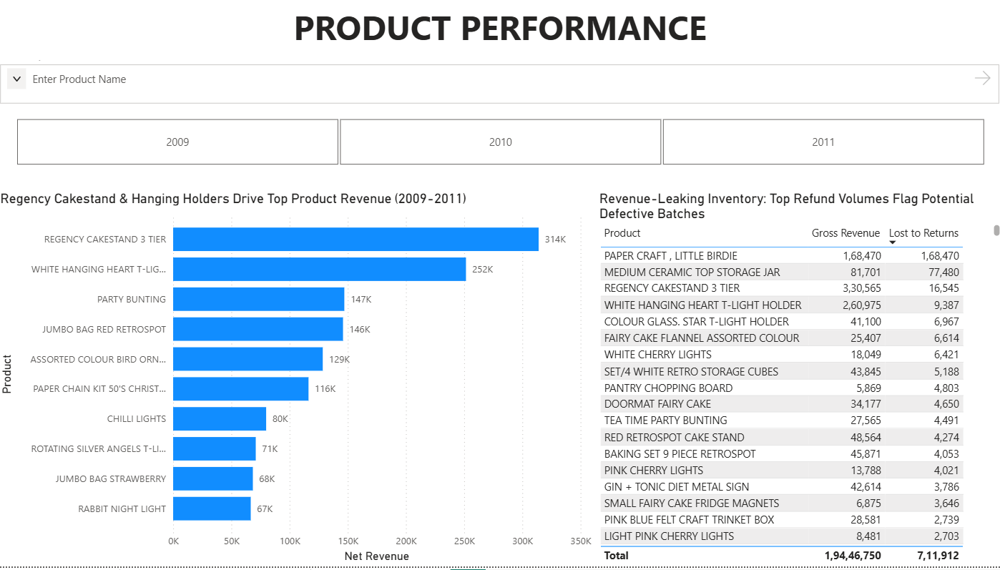

# UK Online Retail II — Power BI Analytics Project

An end-to-end analytics project built on the Online Retail II dataset (~1M transaction rows, 2009–2011). Data was cleaned and staged using SQL, then modeled and visualized in Power BI to surface practical, business-relevant insights.

---

## 1. Data Overview

- **Source:** [UK Online Retail II dataset](https://archive.ics.uci.edu/dataset/502/online+retail+ii) (UCI Machine Learning Repository), 2009–2011 transaction logs. Raw CSV isn't included in this repo — download it directly from the source link above if you want to rerun the pipeline.
- **Volume:** ~1,000,000 line items
- **Process:** Raw data was cleaned and staged in SQL before being loaded into Power BI as a star schema (`fact_sales` linked to `dim_customer`, `dim_product`, and `dim_date`)
- **Cleaning notes:**
  - Unauthenticated/guest orders (missing Customer IDs) were grouped under a single `'Guest'` key rather than dropped, since they still represent real revenue
  - Removed roughly £240K+ of non-product entries (Amazon fees, bank charges, and other admin/ledger noise) that aren't actual merchandise transactions and would skew product-level metrics

---

## 2. North Star Metrics & Dimensions

**Core metrics**
- **Gross Revenue:** £19.45M — total revenue before returns
- **Net Revenue:** £18.73M — revenue after returns are deducted
- **Lost to Returns:** £711.91K — value of returned/cancelled merchandise
- **Return Rate:** 3.66% — share of gross revenue lost to returns

**Dimensions used**
- Time: Year, Quarter, Year-Month
- Geography: UK vs. international markets
- Customer type: Registered customers vs. Guest checkouts
- Product: SKU-level revenue and return totals

---

## 3. Insights & Recommendations

📊 *The interactive Power BI dashboard behind these insights can be downloaded [here](enterprise_retail_analytics.pbix).*

### Page 1 — Executive Summary


**What the data shows:**
- The business is highly seasonal. Revenue stays fairly flat through Q1–Q3, then climbs sharply from August onward and peaks every November at around £1.5M/month. Outside that window, the company is essentially running on a much thinner margin of cash flow.
- 2010 and 2011 had almost identical gross revenue (+0.97% growth), but returns nearly doubled — from £237K in 2010 to £454K in 2011 — pushing the return rate from 2.56% to 4.85%. **In other words, the business didn't grow much, but it got noticeably worse at keeping what it sold.**

**Recommendations:**
- **Treat the Q4 surge as a buffer, not a bonus.** Set aside a portion of November's peak revenue specifically to cover the slower January–April months instead of spending it as if it were steady income.
- **Dig into why returns rose in 2011 even though sales didn't.** This is worth investigating before assuming it's a one-off — it could point to a packaging issue, a product quality problem, or even inaccurate listings that are setting the wrong expectations.

---

### Page 2 — Geographic & Customer Insights


**What the data shows:**
- The UK accounts for about 85% of net revenue over the two-year period. Among the remaining international sales, EIRE (Ireland) and mainland Europe — particularly the Netherlands and Germany — are clearly the strongest markets.
- A handful of smaller markets (Switzerland, Spain, Belgium, Sweden, Denmark) consistently show up in the top 10 for international revenue, despite getting no dedicated marketing attention. **That's a reasonable signal there's some organic demand worth testing further.**
- Guest checkouts generated about £2.8M — **nearly 5x more than the single highest-spending registered customer** (Customer ID 18102, at ~£0.6M). It's hard to say for certain without more context on how the business runs, but this likely points to either a loyalty/retention gap or simply that guest checkout is the easier, preferred option for most buyers.

**Recommendations:**
- **Focus international marketing spend on EIRE, the Netherlands, and Germany** rather than spreading it thin across many countries — these markets already show the strongest organic pull.
- Run small, low-cost tests in a couple of the "emerging" markets (e.g., Switzerland and Spain) — localized checkout currency or a translated landing page — to see if demand responds before committing a bigger budget.
- Look into converting some guest checkouts into registered accounts (e.g., a simple incentive at checkout), mainly to get better visibility into repeat customers and lifetime value, while keeping the option to check out as a guest for those who prefer it.

---

### Page 3 — Product Performance


**What the data shows:**
- A small set of products carries most of the revenue. The Regency Cakestand 3-Tier (£314K) and the White Hanging Heart T-Light Holder (£252K) are the clear top performers.
- A few SKUs stand out for the wrong reason. "Paper Craft, Little Birdie" brought in £168,470 in gross revenue — **and lost essentially the same amount to returns, a near-100% return rate.** Medium Ceramic Storage Jars weren't far behind, with £77,480 in returns against £81,701 in sales.

**Recommendations:**
- Make sure stock levels for the top-performing SKUs (Cakestand, T-Light Holder) are well managed heading into the August–November ramp-up, since running out during peak season would have an outsized impact on revenue.
- **Pause and investigate the "Paper Craft, Little Birdie" and Ceramic Storage Jar SKUs before reordering.** A return rate that high usually points to a quality or packaging problem rather than normal customer behavior, and it's worth confirming before restocking.

---

## 4. Data Cleaning

A few cleaning decisions were worth calling out explicitly, since they affect how the numbers above should be interpreted.

**Handling missing customers**
```sql
COALESCE(NULLIF(TRIM(CustomerID), ''), 'Guest') AS CustomerID
```
CustomerID was blank in two different ways in the raw data — true NULLs and empty strings after trimming whitespace. Rather than dropping these rows (which would have thrown away real revenue), they're grouped under a single `'Guest'` key so they still show up in revenue totals while being clearly separated from authenticated customers.

**Removing duplicate line items**
```sql
ROW_NUMBER() OVER (
    PARTITION BY Invoice, StockCode, Quantity, InvoiceDate 
    ORDER BY Invoice
) AS duplicate_flag
```
The raw export had duplicate rows for some line items. Partitioning on Invoice + StockCode + Quantity + InvoiceDate together (rather than just Invoice) keeps two genuinely different items on the same invoice intact, while removing exact repeats — only `duplicate_flag = 1` is kept in the final table.

**Filtering out non-sale noise**
```sql
WHERE Price > 0 
  AND Invoice NOT LIKE 'A%'
```
`Price > 0` removes zero-value rows (freebies, write-offs, and similar non-sale entries) that would otherwise distort average order value and product revenue. `Invoice NOT LIKE 'A%'` excludes a small set of "bad debt adjustment" entries in this dataset that aren't real customer transactions and shouldn't be counted as sales or returns.

**Building a clean product dimension**
```sql
ROW_NUMBER() OVER(PARTITION BY Clean_StockCode ORDER BY InvoiceDate DESC) as rn
```
Some StockCodes had slightly inconsistent description text across rows (casing, spacing, or minor wording differences). Codes were standardized with `UPPER(TRIM(...))`, then the most recent description per code was kept as the canonical label, so each product maps to a single clean name in the dashboard.

---

## 5. Project Structure

- `enterprise_retail_analytics.pbix` — Power BI file with the data model and report pages
- `/sql_pipeline` — SQL scripts used for cleaning and staging the raw data
- `/screenshots` — Dashboard screenshots referenced in this README

> **Note:** The raw dataset CSV (~40MB) is intentionally excluded from this repo (see `.gitignore`). Download it from the source link in section 1 if you want to run the pipeline yourself.
